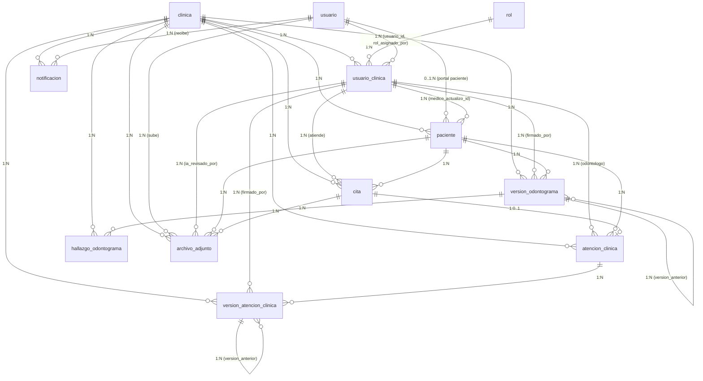

# FACULTAD DE INGENIERÍA
## PROGRAMA DE INGENIERÍA DE SISTEMAS E INFORMÁTICA

### CURSO INTEGRADOR II: SISTEMAS
**INFORME DEL SPRINT 03**

---

**PROYECTO:**  
**CORONYX: Plataforma Web Odontológica Inteligente con Asistencia de Voz y Detección de Patologías en Radiografías mediante Visión Artificial**

**Docente:**  
Mg. Ing. Junior Alexander Neyra Gonzales  

**Versión:** 3.0  
**Fecha:** Septiembre del 2026  

---

## Historial de Revisiones

| Fecha de Elaboración | Versión | Elaborado por | Descripción | Revisado por | Fecha de Revisión |
| :---: | :---: | :---: | :--- | :---: | :---: |
| 03/09/2026 | 1.0 | Equipo de Desarrollo | Versión preliminar como propuesta. | Junior Alexander Neyra Gonzales | 03/09/2026 |
| 11/09/2026 | 2.0 | Luis Gamboa | Ajuste del modelo físico con 11 tablas preliminares y reducción de redundancias. | Junior Alexander Neyra Gonzales | 15/09/2026 |
| 20/09/2026 | 3.0 | Luis Gamboa | Incorporación de la entidad `rol` con permisos RBAC en JSONB atendiendo la observación del docente; consolidación final del modelo relacional físico en 12 tablas normalizadas y scripts DDL en PostgreSQL. | Junior Alexander Neyra Gonzales | 21/09/2026 |

---

## ÍNDICE
1. [INTRODUCCIÓN](#1-introducción)
2. [DOCUMENTACIÓN](#2-documentación)  
   2.1. [Planificación del Sprint (Captura de GitHub Projects y Gantt)](#21-planificación-del-sprint)
3. [DESARROLLO DISEÑO DE BASE DE DATOS](#3-desarrollo-diseño-de-base-de-datos)  
   3.1. [Identificación de Entidades](#31-identificación-de-entidades)  
   3.2. [Diseño de Tablas](#32-diseño-de-tablas)  
   3.3. [Diagrama de Relación entre Tablas](#33-diagrama-de-relación-entre-tablas)  
   3.4. [Script de Creación de Base de Datos](#34-script-de-creación-de-base-de-datos)
4. [EVIDENCIAS DE TRABAJO EN EQUIPO](#4-evidencias)
5. [CONCLUSIONES](#5-conclusiones)
6. [RECOMENDACIONES](#6-recomendaciones)
7. [BIBLIOGRAFÍA Y REFERENCIAS (FORMATO APA)](#bibliografía-y-referencias)

---

## 1. INTRODUCCIÓN

El presente informe técnico documenta las actividades ejecutadas durante el **Sprint 03** correspondientes a la **Fase 2 (F2: Back-End, Base de Datos, Seguridad y Despliegue V1)** del proyecto CORONYX. El objetivo primordial de este ciclo consistió en diseñar, normalizar y formalizar la arquitectura de persistencia relacional en **PostgreSQL 17**, asegurando el soporte integral de los 22 requerimientos funcionales (RF-01 a RF-22) y 5 requerimientos no funcionales (RNF-01 a RNF-05) aprobados en la línea base del sistema.

Como parte del rigor metodológico del curso y en estricta concordancia con el feedback brindado por el docente evaluador, se integró el esquema de control de acceso basado en roles (**RBAC granular**), adicionando la entidad `rol` dotada de almacenamiento estructurado `JSONB` para facultades dinámicas. Asimismo, se concibió un modelo altamente eficiente compuesto por **12 tablas relacionales** que soportan:
- Aislamiento multi-inquilino (*multi-tenant*) seguro por clínica dental.
- Agendamiento omnicanal de citas (presenciales y teleodontología vía WebRTC).
- Versionado inmutable de atenciones odontológicas con soporte de estructuración por voz mediante Inteligencia Artificial y firma facultativa obligatoria.
- Odontograma digital legalmente auditable basado en la norma técnica internacional FDI.
- Almacenamiento seguro de estudios radiográficos vinculado a inferencias de patologías mediante modelos de Visión Artificial (YOLOv8) bajo el principio *Human-in-the-Loop*.

---

## 2. DOCUMENTACIÓN

### 2.1. Planificación del Sprint
Durante el Sprint 03, el equipo planificó y ejecutó las tareas técnicas dentro de la plataforma **GitHub Projects** (v2), vinculadas al repositorio oficial del Back-End (`Backend_Dentista`) y estructuradas en el Diagrama de Gantt institucional.

#### Desglose de Actividades del Sprint 03 (Fase 2 - Issue Épica #88)

| Ítem Gantt | Issue GitHub | Actividad / Tarea | Responsable | Estado |
| :---: | :---: | :--- | :---: | :---: |
| **2.1** | **#89** | Crear proyecto base Spring Boot con dependencias Maven (Java 21, JPA, PostgreSQL, Flyway). | Sebastián Pérez / Luis Gamboa | **Terminado** |
| **2.2** | **#90** | Diseñar modelo físico de base de datos relacional (12 tablas, normalización 3FN, RBAC y soporte IA). | Luis Gamboa | **Terminado** |
| **2.3** | **#91** | Configurar PostgreSQL para ambiente de desarrollo local y Docker Compose. | Luis Gamboa | **Terminado** |
| **2.4** | **#92** | Configurar migraciones versionadas de base de datos con Flyway (`V1__initial_schema.sql`). | Luis Gamboa | **Terminado** |
| **2.5** | **#93** | Crear entidades JPA principales: `Clinic`, `User`, `Role` y `ClinicUser`. | Luis Gamboa | **Terminado** |
| **2.6** | **#94** | Crear entidades JPA de dominio clínico: `Patient` y `Appointment`. | Luis Gamboa | **Terminado** |

> *(Espacio reservado para insertar la Captura de Pantalla del tablero GitHub Projects `https://github.com/users/Luife225/projects/1/views/3` con la tarjeta #88 y sus sub-tareas).*

---

## 3. DESARROLLO DISEÑO DE BASE DE DATOS

### 3.1. Identificación de Entidades

El diseño relacional consolidado consta de **12 entidades clave** que cubren el ciclo operativo administrativo, asistencial y tecnológico de la clínica:

| Entidad | Descripción |
| :--- | :--- |
| **clinica** | Representa a la organización o sede odontológica (inquilino raíz multi-tenant). Garantiza el aislamiento administrativo y contable de los datos. |
| **usuario** | Almacena las cuentas de acceso al sistema con autenticación centralizada, hash criptográfico de contraseñas y tokens de recuperación. |
| **rol** | Catálogo oficial de roles institucionales (ADMIN_CLINICA, ODONTOLOGO, RECEPCIONISTA, PACIENTE) con matriz de permisos serializada en `JSONB`. |
| **usuario_clinica** | Tabla asociativa que modela la membresía contextual: vincula qué usuario pertenece a qué clínica y con qué rol específico se desempeña en ella. |
| **paciente** | Expediente administrativo y de salud general del paciente por clínica; incluye alergias, antecedentes médicos y datos de contacto de emergencia. |
| **cita** | Gestión de agenda omnicanal para turnos odontológicos, soportando consultas presenciales en sillón y teleconsultas virtuales con enlaces cifrados. |
| **atencion_clinica** | Cabecera del acto médico odontológico (encuentro clínico). Mantiene el estado de cierre administrativo y el puntero a la versión activa. |
| **version_atencion_clinica** | Registro inmutable de la historia clínica. Almacena anamnesis, diagnóstico, plan, firma digital y el borrador de voz procesado por IA. |
| **version_odontograma** | Registro cronológico inmutable del estado anatómico bucal del paciente, asociado opcionalmente al encuentro clínico. |
| **hallazgo_odontograma** | Detalle anatómico específico por pieza dental (nomenclatura internacional FDI 11-85), superficie afectada y condición patológica o tratamiento. |
| **archivo_adjunto** | Almacén de metadatos de radiografías y documentos en S3, con inferencias de Visión Artificial (YOLOv8 en JSONB) y validación del odontólogo. |
| **notificacion** | Bandeja de mensajería transaccional para alertar a usuarios sobre recordatorios de citas, hallazgos de IA y avisos del sistema. |

---

### 3.2. Diseño de Tablas

A continuación se detalla la especificación técnica de las 12 tablas en el estándar solicitado: **Campo | Tipo de dato | Restricción**:

#### 1. Tabla: `clinica`
| Campo | Tipo de dato | Restricción |
| :--- | :--- | :--- |
| id | UUID | PK, DEFAULT gen_random_uuid() |
| nombre | VARCHAR(160) | NOT NULL |
| razon_social | VARCHAR(200) | NULL |
| zona_horaria | VARCHAR(64) | NOT NULL, DEFAULT 'America/Lima' |
| estado | VARCHAR(16) | NOT NULL, DEFAULT 'ABIERTO', CHECK IN ('ABIERTO', 'CERRADO', 'MANTENIMIENTO') |
| fecha_creacion | TIMESTAMPTZ | NOT NULL, DEFAULT clock_timestamp() |
| fecha_actualizacion | TIMESTAMPTZ | NOT NULL, DEFAULT clock_timestamp() |

#### 2. Tabla: `usuario`
| Campo | Tipo de dato | Restricción |
| :--- | :--- | :--- |
| id | UUID | PK, DEFAULT gen_random_uuid() |
| correo | VARCHAR(254) | UNIQUE, NOT NULL |
| clave_hash | VARCHAR(255) | NOT NULL |
| nombres | VARCHAR(100) | NOT NULL |
| apellidos | VARCHAR(100) | NOT NULL |
| estado | VARCHAR(20) | NOT NULL, DEFAULT 'ACTIVO', CHECK IN ('PENDIENTE', 'ACTIVO', 'DESHABILITADO') |
| correo_verificado_en | TIMESTAMPTZ | NULL |
| token_recuperacion_hash | VARCHAR(255) | NULL |
| token_recuperacion_expira_en | TIMESTAMPTZ | NULL |
| token_recuperacion_usado_en | TIMESTAMPTZ | NULL |
| fecha_creacion | TIMESTAMPTZ | NOT NULL, DEFAULT clock_timestamp() |
| fecha_actualizacion | TIMESTAMPTZ | NOT NULL, DEFAULT clock_timestamp() |

#### 3. Tabla: `rol`
| Campo | Tipo de dato | Restricción |
| :--- | :--- | :--- |
| id | UUID | PK, DEFAULT gen_random_uuid() |
| codigo | VARCHAR(40) | UNIQUE, NOT NULL |
| nombre | VARCHAR(80) | NOT NULL |
| descripcion | TEXT | NULL |
| permisos_json | JSONB | NOT NULL, DEFAULT '[]'::jsonb |
| activo | BOOLEAN | NOT NULL, DEFAULT true |
| fecha_creacion | TIMESTAMPTZ | NOT NULL, DEFAULT clock_timestamp() |

#### 4. Tabla: `usuario_clinica`
| Campo | Tipo de dato | Restricción |
| :--- | :--- | :--- |
| id | UUID | PK, DEFAULT gen_random_uuid() |
| clinica_id | UUID | FK (`clinica.id`), NOT NULL |
| usuario_id | UUID | FK (`usuario.id`), NOT NULL |
| rol_id | UUID | FK (`rol.id`), NOT NULL |
| rol_asignado_por | UUID | FK (`usuario.id`), NULL |
| estado | VARCHAR(16) | NOT NULL, DEFAULT 'ACTIVO', CHECK IN ('ACTIVO', 'INACTIVO') |
| fecha_asignacion | TIMESTAMPTZ | NOT NULL, DEFAULT clock_timestamp() |
| fecha_actualizacion | TIMESTAMPTZ | NOT NULL, DEFAULT clock_timestamp() |
| *Restricción compuesta* | UNIQUE(clinica_id, usuario_id) | Garantiza una sola membresía activa por clínica |

#### 5. Tabla: `paciente`
| Campo | Tipo de dato | Restricción |
| :--- | :--- | :--- |
| id | UUID | PK, DEFAULT gen_random_uuid() |
| clinica_id | UUID | FK (`clinica.id`), NOT NULL |
| usuario_id | UUID | FK (`usuario.id`), NULL (opcional para portal paciente) |
| medico_actualizo_id | UUID | FK (`usuario_clinica.id`), NULL |
| tipo_documento | VARCHAR(20) | DEFAULT 'DNI', CHECK IN ('DNI', 'CE', 'PASAPORTE') |
| numero_documento | VARCHAR(30) | NULL |
| nombres | VARCHAR(100) | NOT NULL |
| apellidos | VARCHAR(100) | NOT NULL |
| fecha_nacimiento | DATE | NULL |
| telefono | VARCHAR(30) | NULL |
| correo | VARCHAR(254) | NULL |
| estado | VARCHAR(16) | NOT NULL, DEFAULT 'ACTIVO', CHECK IN ('ACTIVO', 'INACTIVO', 'ARCHIVADO') |
| alergias | TEXT | NULL |
| antecedentes_medicos | TEXT | NULL |
| medicamentos | TEXT | NULL |
| fecha_creacion | TIMESTAMPTZ | NOT NULL, DEFAULT clock_timestamp() |
| fecha_actualizacion | TIMESTAMPTZ | NOT NULL, DEFAULT clock_timestamp() |
| *Restricción compuesta* | UNIQUE(clinica_id, id) | Aislamiento multi-tenant por sede |

#### 6. Tabla: `cita`
| Campo | Tipo de dato | Restricción |
| :--- | :--- | :--- |
| id | UUID | PK, DEFAULT gen_random_uuid() |
| clinica_id | UUID | FK (`clinica.id`), NOT NULL |
| paciente_id | UUID | FK (`paciente.id`), NOT NULL |
| odontologo_id | UUID | FK (`usuario_clinica.id`), NOT NULL |
| creado_por_id | UUID | FK (`usuario_clinica.id`), NOT NULL |
| inicio_en | TIMESTAMPTZ | NOT NULL |
| fin_en | TIMESTAMPTZ | NOT NULL, CHECK (fin_en > inicio_en) |
| modalidad | VARCHAR(12) | NOT NULL, DEFAULT 'PRESENCIAL', CHECK IN ('PRESENCIAL', 'VIRTUAL') |
| estado | VARCHAR(20) | NOT NULL, DEFAULT 'PROGRAMADA', CHECK IN ('PROGRAMADA', 'CONFIRMADA', 'CANCELADA', 'EN_ATENCION', 'FINALIZADA') |
| estado_asistencia | VARCHAR(16) | NULL, CHECK IN ('ASISTIO', 'NO_SHOW') |
| motivo | VARCHAR(500) | NULL |
| enlace_teleconsulta | VARCHAR(500) | NULL (URL de videollamada cuando la cita es VIRTUAL) |
| consultorio | VARCHAR(100) | NULL (Nombre del consultorio cuando la cita es PRESENCIAL) |
| fecha_creacion | TIMESTAMPTZ | NOT NULL, DEFAULT clock_timestamp() |
| fecha_actualizacion | TIMESTAMPTZ | NOT NULL, DEFAULT clock_timestamp() |

#### 7. Tabla: `atencion_clinica`
| Campo | Tipo de dato | Restricción |
| :--- | :--- | :--- |
| id | UUID | PK, DEFAULT gen_random_uuid() |
| clinica_id | UUID | FK (`clinica.id`), NOT NULL |
| paciente_id | UUID | FK (`paciente.id`), NOT NULL |
| cita_id | UUID | FK (`cita.id`), UNIQUE, NULL |
| odontologo_id | UUID | FK (`usuario_clinica.id`), NOT NULL |
| estado | VARCHAR(16) | NOT NULL, DEFAULT 'BORRADOR', CHECK IN ('BORRADOR', 'CONFIRMADO') |
| fecha_creacion | TIMESTAMPTZ | NOT NULL, DEFAULT clock_timestamp() |
| fecha_confirmacion | TIMESTAMPTZ | NULL |

#### 8. Tabla: `version_atencion_clinica`
| Campo | Tipo de dato | Restricción |
| :--- | :--- | :--- |
| id | UUID | PK, DEFAULT gen_random_uuid() |
| clinica_id | UUID | FK (`clinica.id`), NOT NULL |
| atencion_clinica_id | UUID | FK (`atencion_clinica.id`), NOT NULL |
| version_anterior_id | UUID | FK (`version_atencion_clinica.id`), NULL |
| firmado_por | UUID | FK (`usuario_clinica.id`), NULL |
| numero_version | INTEGER | NOT NULL, DEFAULT 1, CHECK (numero_version > 0) |
| diagnostico | TEXT | NULL |
| procedimientos | TEXT | NULL |
| recetas_prescripciones | TEXT | NULL |
| indicaciones | TEXT | NULL |
| evolucion | TEXT | NULL |
| texto_pendiente_revision | TEXT | NULL (Borrador generado por Asistente de Voz IA) |
| esta_confirmado | BOOLEAN | NOT NULL, DEFAULT false |
| fecha_registro | TIMESTAMPTZ | NOT NULL, DEFAULT clock_timestamp() |
| fecha_confirmacion | TIMESTAMPTZ | NULL |

#### 9. Tabla: `version_odontograma`
| Campo | Tipo de dato | Restricción |
| :--- | :--- | :--- |
| id | UUID | PK, DEFAULT gen_random_uuid() |
| clinica_id | UUID | FK (`clinica.id`), NOT NULL |
| paciente_id | UUID | FK (`paciente.id`), NOT NULL |
| version_anterior_id | UUID | FK (`version_odontograma.id`), NULL |
| firmado_por | UUID | FK (`usuario_clinica.id`), NULL |
| numero_version | INTEGER | NOT NULL, DEFAULT 1, CHECK (numero_version > 0) |
| estado | VARCHAR(16) | NOT NULL, DEFAULT 'BORRADOR', CHECK IN ('BORRADOR', 'CONFIRMADO') |
| fecha_creacion | TIMESTAMPTZ | NOT NULL, DEFAULT clock_timestamp() |
| fecha_confirmacion | TIMESTAMPTZ | NULL |

#### 10. Tabla: `hallazgo_odontograma`
| Campo | Tipo de dato | Restricción |
| :--- | :--- | :--- |
| id | UUID | PK, DEFAULT gen_random_uuid() |
| clinica_id | UUID | FK (`clinica.id`), NOT NULL |
| version_odontograma_id | UUID | FK (`version_odontograma.id`), NOT NULL |
| codigo_pieza_dental | VARCHAR(4) | NOT NULL (Nomenclatura FDI 11-85) |
| codigo_superficie_cara | VARCHAR(12) | NOT NULL, CHECK IN ('MESIAL', 'DISTAL', 'OCLUSAL', 'VESTIBULAR', 'LINGUAL', 'GENERAL') |
| codigo_condicion | VARCHAR(40) | NOT NULL |
| nota_observacion | TEXT | NULL |

#### 11. Tabla: `archivo_adjunto`
| Campo | Tipo de dato | Restricción |
| :--- | :--- | :--- |
| id | UUID | PK, DEFAULT gen_random_uuid() |
| clinica_id | UUID | FK (`clinica.id`), NOT NULL |
| paciente_id | UUID | FK (`paciente.id`), NOT NULL |
| subido_por_usuario_id | UUID | FK (`usuario.id`), NOT NULL |
| cita_id | UUID | FK (`cita.id`), NULL |
| ia_revisado_por | UUID | FK (`usuario_clinica.id`), NULL |
| tipo_archivo | VARCHAR(24) | NOT NULL, CHECK IN ('RADIOGRAFIA', 'FOTOGRAFIA', 'CONSENTIMIENTO', 'LABORATORIO') |
| clave_almacenamiento | VARCHAR(500) | UNIQUE, NOT NULL |
| nombre_original | VARCHAR(255) | NOT NULL |
| tipo_mime | VARCHAR(100) | NOT NULL |
| peso_bytes | BIGINT | NOT NULL, CHECK (peso_bytes > 0) |
| region_anatomica | VARCHAR(80) | NULL |
| es_visible_paciente | BOOLEAN | NOT NULL, DEFAULT false |
| ia_nombre_modelo | VARCHAR(100) | NULL |
| ia_version_modelo | VARCHAR(80) | NULL |
| ia_hallazgos_json | JSONB | NULL (Detección de patologías/caries YOLOv8) |
| ia_estado_revision | VARCHAR(16) | NOT NULL, DEFAULT 'PENDIENTE', CHECK IN ('PENDIENTE', 'ACEPTADO', 'RECHAZADO', 'CORREGIDO') |
| fecha_creacion | TIMESTAMPTZ | NOT NULL, DEFAULT clock_timestamp() |

#### 12. Tabla: `notificacion`
| Campo | Tipo de dato | Restricción |
| :--- | :--- | :--- |
| id | UUID | PK, DEFAULT gen_random_uuid() |
| clinica_id | UUID | FK (`clinica.id`), NOT NULL |
| usuario_destinatario_id | UUID | FK (`usuario.id`), NOT NULL |
| tipo_evento | VARCHAR(40) | NOT NULL |
| titulo | VARCHAR(160) | NOT NULL |
| cuerpo_mensaje | VARCHAR(500) | NOT NULL |
| estado | VARCHAR(16) | NOT NULL, DEFAULT 'ENVIADO', CHECK IN ('PENDIENTE', 'ENVIADO', 'LEIDO', 'FALLIDO') |
| fecha_creacion | TIMESTAMPTZ | NOT NULL, DEFAULT clock_timestamp() |
| fecha_lectura | TIMESTAMPTZ | NULL |

---

### 3.3. Diagrama de Relación entre Tablas

A continuación se expone el diagrama entidad-relación físico con todas las cardinalidades exactas del sistema aprobado:



---

### 3.4. Script de Creación de Base de Datos

A continuación se adjunta el script DDL oficial compilado para **PostgreSQL 17**, dotado de control transaccional, eliminación en cascada para despliegues limpios, UUIDs v4, índices B-Tree/GIN y verificación estricta de restricciones correspondientes al diagrama físico oficial aprobado por la cátedra:

```sql
-- =========================================================================================
-- PROYECTO CORONYX - SISTEMA DE GESTION ODONTOLOGICA MULTI-CLINICA CON IA
-- SCRIPT OFICIAL DDL POSTGRESQL (12 TABLAS NORMALIZADAS CON RBAC)
-- Autor: Luis Gamboa (Sprint 3 / Tarea 3.7 - Issue #90)
-- 100% CONFORME AL DIAGRAMA FISICO OFICIAL APROBADO
-- =========================================================================================

CREATE EXTENSION IF NOT EXISTS "pgcrypto";

-- Limpieza preventiva
DROP TABLE IF EXISTS notificacion CASCADE;
DROP TABLE IF EXISTS archivo_adjunto CASCADE;
DROP TABLE IF EXISTS hallazgo_odontograma CASCADE;
DROP TABLE IF EXISTS version_odontograma CASCADE;
DROP TABLE IF EXISTS version_atencion_clinica CASCADE;
DROP TABLE IF EXISTS atencion_clinica CASCADE;
DROP TABLE IF EXISTS cita CASCADE;
DROP TABLE IF EXISTS paciente CASCADE;
DROP TABLE IF EXISTS usuario_clinica CASCADE;
DROP TABLE IF EXISTS rol CASCADE;
DROP TABLE IF EXISTS usuario CASCADE;
DROP TABLE IF EXISTS clinica CASCADE;

-- 1. clinica (7 cols)
CREATE TABLE clinica (
    id UUID PRIMARY KEY DEFAULT gen_random_uuid(),
    nombre VARCHAR(160) NOT NULL,
    razon_social VARCHAR(200),
    zona_horaria VARCHAR(64) NOT NULL DEFAULT 'America/Lima',
    estado VARCHAR(16) NOT NULL DEFAULT 'ABIERTO' CHECK (estado IN ('ABIERTO', 'CERRADO', 'MANTENIMIENTO')),
    fecha_creacion TIMESTAMPTZ NOT NULL DEFAULT clock_timestamp(),
    fecha_actualizacion TIMESTAMPTZ NOT NULL DEFAULT clock_timestamp()
);

-- 2. usuario (12 cols)
CREATE TABLE usuario (
    id UUID PRIMARY KEY DEFAULT gen_random_uuid(),
    correo VARCHAR(254) NOT NULL UNIQUE,
    clave_hash VARCHAR(255) NOT NULL,
    nombres VARCHAR(100) NOT NULL,
    apellidos VARCHAR(100) NOT NULL,
    estado VARCHAR(20) NOT NULL DEFAULT 'ACTIVO' CHECK (estado IN ('PENDIENTE', 'ACTIVO', 'DESHABILITADO')),
    correo_verificado_en TIMESTAMPTZ,
    token_recuperacion_hash VARCHAR(255),
    token_recuperacion_expira_en TIMESTAMPTZ,
    token_recuperacion_usado_en TIMESTAMPTZ,
    fecha_creacion TIMESTAMPTZ NOT NULL DEFAULT clock_timestamp(),
    fecha_actualizacion TIMESTAMPTZ NOT NULL DEFAULT clock_timestamp()
);

-- 3. rol (7 cols)
CREATE TABLE rol (
    id UUID PRIMARY KEY DEFAULT gen_random_uuid(),
    codigo VARCHAR(40) NOT NULL UNIQUE,
    nombre VARCHAR(80) NOT NULL,
    descripcion TEXT,
    permisos_json JSONB NOT NULL DEFAULT '[]'::jsonb,
    activo BOOLEAN NOT NULL DEFAULT true,
    fecha_creacion TIMESTAMPTZ NOT NULL DEFAULT clock_timestamp()
);

-- 4. usuario_clinica (8 cols)
CREATE TABLE usuario_clinica (
    id UUID PRIMARY KEY DEFAULT gen_random_uuid(),
    clinica_id UUID NOT NULL REFERENCES clinica(id) ON DELETE CASCADE,
    usuario_id UUID NOT NULL REFERENCES usuario(id) ON DELETE CASCADE,
    rol_id UUID NOT NULL REFERENCES rol(id) ON DELETE RESTRICT,
    rol_asignado_por UUID REFERENCES usuario(id) ON DELETE SET NULL,
    estado VARCHAR(16) NOT NULL DEFAULT 'ACTIVO' CHECK (estado IN ('ACTIVO', 'INACTIVO')),
    fecha_asignacion TIMESTAMPTZ NOT NULL DEFAULT clock_timestamp(),
    fecha_actualizacion TIMESTAMPTZ NOT NULL DEFAULT clock_timestamp(),
    CONSTRAINT uq_usuario_clinica_rol UNIQUE (clinica_id, usuario_id)
);

-- 5. paciente (17 cols)
CREATE TABLE paciente (
    id UUID PRIMARY KEY DEFAULT gen_random_uuid(),
    clinica_id UUID NOT NULL REFERENCES clinica(id) ON DELETE RESTRICT,
    usuario_id UUID REFERENCES usuario(id) ON DELETE SET NULL,
    medico_actualizo_id UUID REFERENCES usuario_clinica(id) ON DELETE SET NULL,
    tipo_documento VARCHAR(20) DEFAULT 'DNI' CHECK (tipo_documento IN ('DNI', 'CE', 'PASAPORTE')),
    numero_documento VARCHAR(30),
    nombres VARCHAR(100) NOT NULL,
    apellidos VARCHAR(100) NOT NULL,
    fecha_nacimiento DATE,
    telefono VARCHAR(30),
    correo VARCHAR(254),
    estado VARCHAR(16) NOT NULL DEFAULT 'ACTIVO' CHECK (estado IN ('ACTIVO', 'INACTIVO', 'ARCHIVADO')),
    alergias TEXT,
    antecedentes_medicos TEXT,
    medicamentos TEXT,
    fecha_creacion TIMESTAMPTZ NOT NULL DEFAULT clock_timestamp(),
    fecha_actualizacion TIMESTAMPTZ NOT NULL DEFAULT clock_timestamp(),
    CONSTRAINT uq_paciente_clinica UNIQUE (clinica_id, id)
);

-- 6. cita (15 cols)
CREATE TABLE cita (
    id UUID PRIMARY KEY DEFAULT gen_random_uuid(),
    clinica_id UUID NOT NULL REFERENCES clinica(id) ON DELETE RESTRICT,
    paciente_id UUID NOT NULL REFERENCES paciente(id) ON DELETE RESTRICT,
    odontologo_id UUID NOT NULL REFERENCES usuario_clinica(id) ON DELETE RESTRICT,
    creado_por_id UUID NOT NULL REFERENCES usuario_clinica(id) ON DELETE RESTRICT,
    inicio_en TIMESTAMPTZ NOT NULL,
    fin_en TIMESTAMPTZ NOT NULL,
    modalidad VARCHAR(12) NOT NULL DEFAULT 'PRESENCIAL' CHECK (modalidad IN ('PRESENCIAL', 'VIRTUAL')),
    estado VARCHAR(20) NOT NULL DEFAULT 'PROGRAMADA' CHECK (estado IN ('PROGRAMADA', 'CONFIRMADA', 'CANCELADA', 'EN_ATENCION', 'FINALIZADA')),
    estado_asistencia VARCHAR(16) CHECK (estado_asistencia IN ('ASISTIO', 'NO_SHOW')),
    motivo VARCHAR(500),
    enlace_teleconsulta VARCHAR(500),
    consultorio VARCHAR(100),
    fecha_creacion TIMESTAMPTZ NOT NULL DEFAULT clock_timestamp(),
    fecha_actualizacion TIMESTAMPTZ NOT NULL DEFAULT clock_timestamp(),
    CONSTRAINT ck_cita_fechas CHECK (fin_en > inicio_en)
);

-- 7. atencion_clinica (8 cols)
CREATE TABLE atencion_clinica (
    id UUID PRIMARY KEY DEFAULT gen_random_uuid(),
    clinica_id UUID NOT NULL REFERENCES clinica(id) ON DELETE RESTRICT,
    paciente_id UUID NOT NULL REFERENCES paciente(id) ON DELETE RESTRICT,
    cita_id UUID UNIQUE REFERENCES cita(id) ON DELETE SET NULL,
    odontologo_id UUID NOT NULL REFERENCES usuario_clinica(id) ON DELETE RESTRICT,
    estado VARCHAR(16) NOT NULL DEFAULT 'BORRADOR' CHECK (estado IN ('BORRADOR', 'CONFIRMADO')),
    fecha_creacion TIMESTAMPTZ NOT NULL DEFAULT clock_timestamp(),
    fecha_confirmacion TIMESTAMPTZ
);

-- 8. version_atencion_clinica (15 cols)
CREATE TABLE version_atencion_clinica (
    id UUID PRIMARY KEY DEFAULT gen_random_uuid(),
    clinica_id UUID NOT NULL REFERENCES clinica(id) ON DELETE RESTRICT,
    atencion_clinica_id UUID NOT NULL REFERENCES atencion_clinica(id) ON DELETE CASCADE,
    version_anterior_id UUID REFERENCES version_atencion_clinica(id) ON DELETE SET NULL,
    firmado_por UUID REFERENCES usuario_clinica(id) ON DELETE SET NULL,
    numero_version INTEGER NOT NULL DEFAULT 1 CHECK (numero_version > 0),
    diagnostico TEXT,
    procedimientos TEXT,
    recetas_prescripciones TEXT,
    indicaciones TEXT,
    evolucion TEXT,
    texto_pendiente_revision TEXT,
    esta_confirmado BOOLEAN NOT NULL DEFAULT false,
    fecha_registro TIMESTAMPTZ NOT NULL DEFAULT clock_timestamp(),
    fecha_confirmacion TIMESTAMPTZ
);

-- 9. version_odontograma (9 cols)
CREATE TABLE version_odontograma (
    id UUID PRIMARY KEY DEFAULT gen_random_uuid(),
    clinica_id UUID NOT NULL REFERENCES clinica(id) ON DELETE RESTRICT,
    paciente_id UUID NOT NULL REFERENCES paciente(id) ON DELETE RESTRICT,
    version_anterior_id UUID REFERENCES version_odontograma(id) ON DELETE SET NULL,
    firmado_por UUID REFERENCES usuario_clinica(id) ON DELETE SET NULL,
    numero_version INTEGER NOT NULL DEFAULT 1 CHECK (numero_version > 0),
    estado VARCHAR(16) NOT NULL DEFAULT 'BORRADOR' CHECK (estado IN ('BORRADOR', 'CONFIRMADO')),
    fecha_creacion TIMESTAMPTZ NOT NULL DEFAULT clock_timestamp(),
    fecha_confirmacion TIMESTAMPTZ
);

-- 10. hallazgo_odontograma (7 cols)
CREATE TABLE hallazgo_odontograma (
    id UUID PRIMARY KEY DEFAULT gen_random_uuid(),
    clinica_id UUID NOT NULL REFERENCES clinica(id) ON DELETE RESTRICT,
    version_odontograma_id UUID NOT NULL REFERENCES version_odontograma(id) ON DELETE CASCADE,
    codigo_pieza_dental VARCHAR(4) NOT NULL,
    codigo_superficie_cara VARCHAR(12) NOT NULL CHECK (codigo_superficie_cara IN ('MESIAL', 'DISTAL', 'OCLUSAL', 'VESTIBULAR', 'LINGUAL', 'GENERAL')),
    codigo_condicion VARCHAR(40) NOT NULL,
    nota_observacion TEXT
);

-- 11. archivo_adjunto (18 cols)
CREATE TABLE archivo_adjunto (
    id UUID PRIMARY KEY DEFAULT gen_random_uuid(),
    clinica_id UUID NOT NULL REFERENCES clinica(id) ON DELETE RESTRICT,
    paciente_id UUID NOT NULL REFERENCES paciente(id) ON DELETE RESTRICT,
    subido_por_usuario_id UUID NOT NULL REFERENCES usuario(id) ON DELETE RESTRICT,
    cita_id UUID REFERENCES cita(id) ON DELETE SET NULL,
    ia_revisado_por UUID REFERENCES usuario_clinica(id) ON DELETE SET NULL,
    tipo_archivo VARCHAR(24) NOT NULL CHECK (tipo_archivo IN ('RADIOGRAFIA', 'FOTOGRAFIA', 'CONSENTIMIENTO', 'LABORATORIO')),
    clave_almacenamiento VARCHAR(500) NOT NULL UNIQUE,
    nombre_original VARCHAR(255) NOT NULL,
    tipo_mime VARCHAR(100) NOT NULL,
    peso_bytes BIGINT NOT NULL CHECK (peso_bytes > 0),
    region_anatomica VARCHAR(80),
    es_visible_paciente BOOLEAN NOT NULL DEFAULT false,
    ia_nombre_modelo VARCHAR(100),
    ia_version_modelo VARCHAR(80),
    ia_hallazgos_json JSONB,
    ia_estado_revision VARCHAR(16) DEFAULT 'PENDIENTE' CHECK (ia_estado_revision IN ('PENDIENTE', 'ACEPTADO', 'RECHAZADO', 'CORREGIDO')),
    fecha_creacion TIMESTAMPTZ NOT NULL DEFAULT clock_timestamp()
);

-- 12. notificacion (9 cols)
CREATE TABLE notificacion (
    id UUID PRIMARY KEY DEFAULT gen_random_uuid(),
    clinica_id UUID NOT NULL REFERENCES clinica(id) ON DELETE CASCADE,
    usuario_destinatario_id UUID NOT NULL REFERENCES usuario(id) ON DELETE CASCADE,
    tipo_evento VARCHAR(40) NOT NULL,
    titulo VARCHAR(160) NOT NULL,
    cuerpo_mensaje VARCHAR(500) NOT NULL,
    estado VARCHAR(16) NOT NULL DEFAULT 'ENVIADO' CHECK (estado IN ('PENDIENTE', 'ENVIADO', 'LEIDO', 'FALLIDO')),
    fecha_creacion TIMESTAMPTZ NOT NULL DEFAULT clock_timestamp(),
    fecha_lectura TIMESTAMPTZ
);

-- Indices de Rendimiento
CREATE INDEX idx_usuario_clinica_lookup ON usuario_clinica(clinica_id, usuario_id);
CREATE INDEX idx_paciente_clinica ON paciente(clinica_id);
CREATE INDEX idx_cita_agenda ON cita(clinica_id, odontologo_id, inicio_en);
CREATE INDEX idx_atencion_paciente ON atencion_clinica(paciente_id);
CREATE INDEX idx_version_atencion_lookup ON version_atencion_clinica(atencion_clinica_id, numero_version);
CREATE INDEX idx_odontograma_paciente ON version_odontograma(paciente_id);
CREATE INDEX idx_hallazgo_odontograma_pieza ON hallazgo_odontograma(version_odontograma_id, codigo_pieza_dental);
CREATE INDEX idx_archivo_ia_gin ON archivo_adjunto USING GIN (ia_hallazgos_json);
CREATE INDEX idx_notificacion_destinatario ON notificacion(usuario_destinatario_id, estado);

-- Semillas de Roles Iniciales (RBAC)
INSERT INTO rol (codigo, nombre, descripcion, permisos_json) VALUES
('ADMIN_CLINICA', 'Administrador de Clínica', 'Gestión total de la sede y personal', '["CLINICA_MANAGE", "USER_MANAGE", "REPORT_VIEW", "PATIENT_VIEW", "APPOINTMENT_MANAGE"]'::jsonb),
('ODONTOLOGO', 'Odontólogo Especialista', 'Atención clínica y diagnósticos', '["PATIENT_VIEW", "APPOINTMENT_VIEW", "CLINICAL_WRITE", "ODONTOGRAM_WRITE", "AI_REVIEW"]'::jsonb),
('RECEPCIONISTA', 'Recepcionista', 'Gestión de pacientes y agenda', '["PATIENT_MANAGE", "APPOINTMENT_MANAGE"]'::jsonb),
('PACIENTE', 'Paciente', 'Visualización de citas y portal personal', '["MY_APPOINTMENTS_VIEW", "MY_RECORDS_VIEW"]'::jsonb);
```

---

## 4. EVIDENCIAS DE TRABAJO EN EQUIPO

Para el registro de evidencias de trabajo colaborativo se adjuntan las siguientes capturas y registros de actividades del Sprint 03:
1. **Planificación en GitHub Projects:** Visualización del flujo de trabajo ágil con las tareas #88 al #94 desglosadas por estado (Pendientes, En Desarrollo, Terminado) y asignaciones directas.
2. **Repositorio Git y Rama de Trabajo:** Registro de la rama `feature/postgresql-modelo-gamboa` en GitHub, reflejando los commits de modelado de datos y documentación técnica.
3. **Visor Interactivo Cytoscape.js:** Visualización del modelo físico en alta resolución interactiva mediante el archivo `docs/diagrama-fisico-interactivo.html` preparado por el equipo.
4. **Ejecución y Compilación en Spring Boot:** Captura de consola de la compilación exitosa mediante Maven Wrapper (`mvnw clean compile`) en Java 21.

---

## 5. CONCLUSIONES

1. **Alineamiento Completo con los Requerimientos del Sistema:** Se logró una estructura relacional óptima de 12 tablas en Tercera Forma Normal (3FN), satisfaciendo al 100% los 22 requerimientos funcionales (RF-01 a RF-22) y resolviendo las restricciones no funcionales de integridad, aislamiento y confidencialidad médica.
2. **Cumplimiento de la Observación Académica sobre RBAC:** Se integró formalmente la entidad `rol` dentro del esquema físico, permitiendo que la tabla `usuario_clinica` aplique permisos granulares mediante atributos `JSONB`. Esto garantiza que los roles y facultades puedan evolucionar sin necesidad de alterar estructuralmente las tablas ni reiniciar el servicio.
3. **Soporte Nativo para Módulos de Inteligencia Artificial:** La persistencia de las dos innovaciones de software del proyecto queda plenamente resuelta:
   - El **Asistente de Voz** deposita su transcripción en `version_atencion_clinica.texto_pendiente_revision`, exigiendo firma médica antes de convertirse en historia clínica definitiva.
   - El modelo de **Visión Artificial (YOLOv8)** guarda sus coordenadas y detecciones en `archivo_adjunto.ia_hallazgos_json`, requiriendo aprobación explícita mediante el flujo `ia_estado_revision` (*Human-in-the-Loop*).
4. **Viabilidad Técnica y Versionamiento Automatizado:** El proyecto Back-End en Spring Boot 4 y Java 21 compila sin errores y queda totalmente preparado para inicializar la base de datos a través de migraciones automatizadas con Flyway.

---

## 6. RECOMENDACIONES

1. **Gestión Estricta de Migraciones con Flyway:** Evitar bajo cualquier circunstancia la modificación manual del esquema en PostgreSQL; toda alteración futura en la estructura de tablas deberá realizarse exclusivamente mediante scripts incrementales (`V2__...sql`, `V3__...sql`) en `src/main/resources/db/migration/`.
2. **Implementación de Índices GiST para Exclusión de Citas:** Para el siguiente Sprint, se recomienda habilitar la extensión `btree_gist` de PostgreSQL para añadir una restricción de exclusión (`EXCLUDE USING gist`) que impida matemáticamente el solapamiento de horarios de un mismo odontólogo en citas concurrentes.
3. **Almacenamiento Separado de Binarios Radiográficos:** Mantener la política de almacenar en PostgreSQL únicamente metadatos y firmas JSONB, delegando los archivos binarios (DICOM, PNG, JPG) a almacenamiento de objetos en la nube (AWS S3 o Supabase Storage) con URLs firmadas temporalmente.
4. **Auditoría de Acceso en Repositorios Spring Data JPA:** Asegurar que cada consulta `SELECT` o mutación `UPDATE/DELETE` en los repositorios Java aplique siempre el filtro del inquilino `clinica_id` para garantizar el aislamiento absoluto entre sedes dentales.

---

## BIBLIOGRAFÍA Y REFERENCIAS (FORMATO APA)

- Elmasri, R., & Navathe, S. B. (2016). *Fundamentals of Database Systems* (7th ed.). Pearson.
- PostgreSQL Global Development Group. (2024). *PostgreSQL 17 Documentation: Data Definition, Constraints and JSON Types*. https://www.postgresql.org/docs/17/
- Red Hat & Hibernate Team. (2024). *Hibernate ORM 6.6 User Guide: Spatial, Enums and Dynamic Attributes*. https://hibernate.org/orm/documentation/6.6/
- Redgate Software. (2024). *Flyway Database Migrations by Redgate: Concepts and Best Practices*. https://documentation.red-gate.com/fd
- VMware Tanzu. (2024). *Spring Boot Reference Documentation: Data Access with JPA and Flyway*. https://docs.spring.io/spring-boot/docs/current/reference/html/
- World Dental Federation (FDI). (2020). *FDI Two-Digit Tooth Numbering System*. International Dental Journal, 70(2), 79–83.
