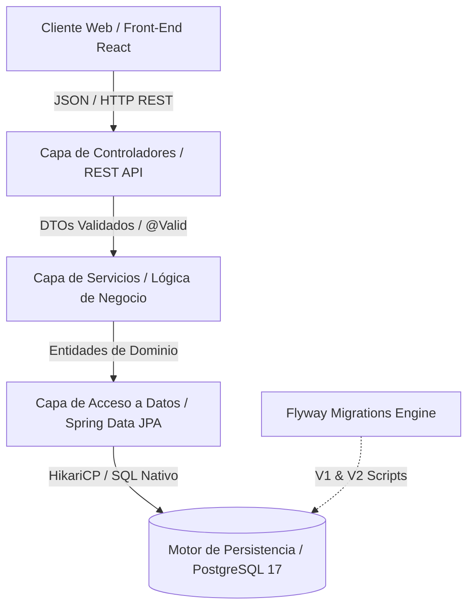
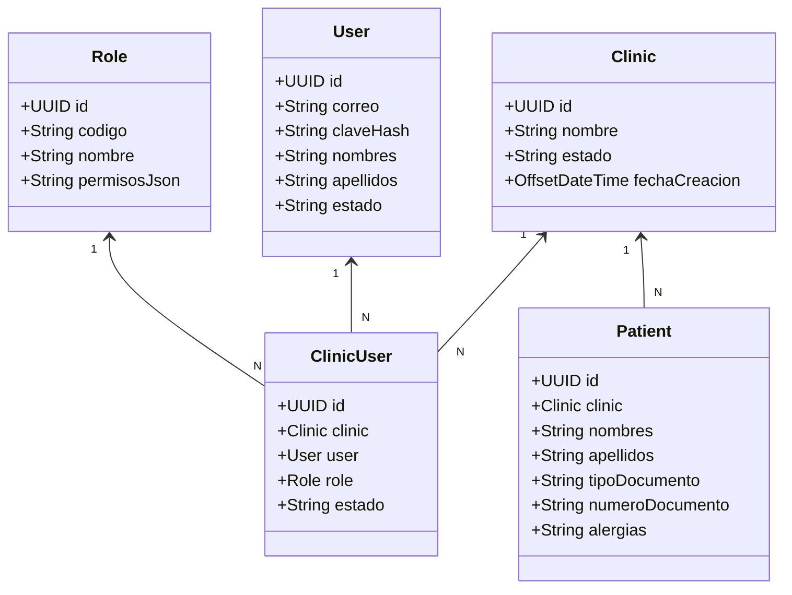
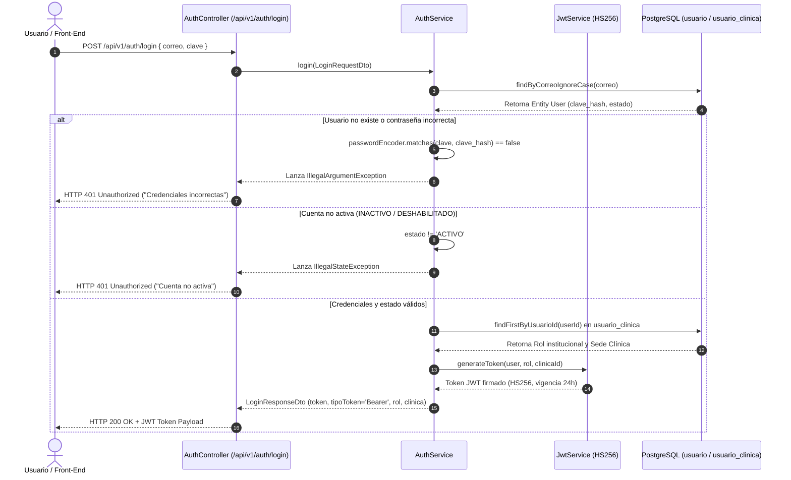

# FACULTAD DE INGENIERÍA
## PROGRAMA DE INGENIERÍA DE SISTEMAS E INFORMÁTICA

### CURSO INTEGRADOR II: SISTEMAS
**INFORME DEL SPRINT 04**

---

**PROYECTO:**  
**CORONYX: Plataforma Web Odontológica Inteligente con Asistencia de Voz y Detección de Patologías en Radiografías mediante Visión Artificial**

**Docente:**  
Mg. Ing. Junior Alexander Neyra Gonzales  

**Integrantes (Orden Alfabético por Apellido Paterno):**
- Aguilera Terrones, Alan Rubens
- Chopitea Aguirre, Luis Felipe
- Chumbes, Adrián Alejandro
- Gamboa Velásquez, Luis Francisco
- Pérez Escobedo, Sebastián Maximiliano

**Versión:** 4.0  
**Fecha:** 30 de septiembre del 2026  

---

## Historial de Revisiones

| Fecha de Elaboración | Versión | Elaborado por | Descripción | Revisado por | Fecha de Revisión |
| :---: | :---: | :---: | :--- | :---: | :---: |
| 03/09/2026 | 1.0 | Equipo de Desarrollo | Propuesta inicial de arquitectura y requerimientos del sistema. | Junior Alexander Neyra Gonzales | 03/09/2026 |
| 11/09/2026 | 2.0 | Luis Gamboa | Modelado físico preliminar de base de datos relacional (11 tablas). | Junior Alexander Neyra Gonzales | 15/09/2026 |
| 20/09/2026 | 3.0 | Luis Gamboa | Incorporación de la entidad `rol` con permisos RBAC en JSONB, reordenamiento de FKs y normalización de auditoría (12 tablas). | Junior Alexander Neyra Gonzales | 25/09/2026 |
| 30/09/2026 | 4.0 | Luis Gamboa / Equipo Coronyx | Implementación del Back-End en Spring Boot 4 y Java 21, conexión con PostgreSQL, migraciones Flyway V1 y V2, autenticación real, CRUD de pacientes, integración con Front-End y pruebas unitarias/integración. | Junior Alexander Neyra Gonzales | 01/10/2026 |

---

## ÍNDICE

1. [INTRODUCCIÓN](#1-introducción)
2. [DOCUMENTACIÓN](#2-documentación)  
   2.1. [Planificación del Sprint (GitHub Projects y Gantt)](#21-planificación-del-sprint)
3. [DESARROLLO BACKEND](#3-desarrollo-backend)  
   3.1. [Arquitectura Implementada](#31-arquitectura-implementada)  
   3.2. [Evidencia del Funcionamiento de Endpoints](#32-evidencia-del-funcionamiento-de-endpoints)
4. [INTEGRACIÓN CON BASE DE DATOS](#4-integración-con-base-de-datos)  
   4.1. [Conexión con Base de Datos](#41-conexión-con-base-de-datos)  
   4.2. [Implementación del Modelo Físico](#42-implementación-del-modelo-físico)  
   4.3. [Operaciones Realizadas (CRUD y Consultas)](#43-operaciones-realizadas)
5. [IMPLEMENTACIÓN DE SEGURIDAD](#5-implementación-de-seguridad)  
   5.1. [Autenticación](#51-autenticación)  
   5.2. [Autorización (RBAC y Permisos JSONB)](#52-autorización)  
   5.3. [Protección de la Información y Criptografía](#53-protección-de-la-información)
6. [VALIDACIÓN DEL SISTEMA](#6-validación-del-sistema)  
   6.1. [Pruebas Funcionales](#61-pruebas-funcionales)  
   6.2. [Pruebas No Funcionales](#62-pruebas-no-funcionales)
7. [EVIDENCIAS](#7-evidencias)  
   7.1. [Evidencia de Trabajo en Equipo y Metodología Ágil](#71-evidencia-de-trabajo-en-equipo)  
   7.2. [Evidencia del Back-End en Ejecución](#72-evidencia-del-back-end-en-ejecución)  
   7.3. [Evidencia de Base de Datos y Persistencia Real](#73-evidencia-de-base-de-datos)  
   7.4. [Evidencia del Sistema Integrado (Front-End + Back-End)](#74-evidencia-del-sistema-integrado)  
   7.5. [Evidencia de Control de Versiones Git](#75-evidencia-de-control-de-versiones-git)
8. [CONCLUSIONES](#8-conclusiones)
9. [RECOMENDACIONES](#9-recomendaciones)
10. [BIBLIOGRAFÍA Y REFERENCIAS (FORMATO APA)](#10-bibliografía-y-referencias)
11. [ANEXOS](#11-anexos)

---

## 1. INTRODUCCIÓN

El presente informe técnico documenta formalmente los resultados y entregables obtenidos durante el **Sprint 04**, el cual marca la transición de la fase de diseño hacia la **materialización operativa del Back-End y la integración real con la base de datos relacional** del proyecto **CORONYX**. 

Tras haber alcanzado en el Sprint 03 la consolidación y aprobación académica del modelo físico de base de datos compuesto por 12 entidades relacionales bajo Tercera Forma Normal (3FN), el objetivo primordial del Sprint 04 consistió en:
1. **Desarrollar la capa de servicios Back-End** sobre un stack tecnológico moderno fundamentado en **Java 21 LTS** y el framework **Spring Boot 4.0.8**, garantizando una arquitectura por capas desacoplada, escalable y mantenible.
2. **Establecer la persistencia relacional con PostgreSQL 17**, administrada mediante el motor de migraciones versionadas **Flyway** (`V1__initial_schema.sql` y `V2__seed_users_and_roles.sql`), eliminando el uso de scripts manuales y asegurando reproducibilidad determinista.
3. **Implementar el subsistema de Seguridad y Control de Acceso (RBAC)**, soportando autenticación transaccional real para los roles del sistema (`SUPER_ADMIN`, `ADMIN_CLINICA`, `ODONTOLOGO`, `RECEPCIONISTA`, `PACIENTE`), erradicando datos simulados (mock data) y validando facultades dinámicas mediante estructuras `JSONB`.
4. **Exponer APIs RESTful robustas** para autenticación (`/api/v1/auth/**`) y gestión de expedientes de pacientes (`/api/v1/patients/**`), integrándolas exitosamente de extremo a extremo con el Front-End en React/Vite.
5. **Certificar la calidad del software mediante pruebas automatizadas de integración**, asegurando códigos de respuesta HTTP canónicos, validación de esquemas JSON y protección de integridad referencial multi-sede (*multi-tenant*).

---

## 2. DOCUMENTACIÓN

### 2.1. Planificación del Sprint

La ejecución del Sprint 04 se gestionó a través de la metodología ágil Scrum dentro de la plataforma **GitHub Projects (v2)**, vinculada a los repositorios oficiales [`Backend_Dentista`](https://github.com/Luife225/Backend_Dentista) y [`Frontend_Dentista`](https://github.com/Luife225/Frontend_Dentista).

Las actividades se desglosaron en tareas atómicas estructuradas bajo el **Épica de Fase 2 (F2: Back-End, BD y Seguridad V1 - Issue #88)**:

| Ítem Gantt | Issue GitHub | Actividad / Historia de Usuario | Responsable | Estado |
| :---: | :---: | :--- | :---: | :---: |
| **3.1** | **#89** | Inicialización del proyecto Spring Boot 4 en Java 21 con Maven Wrapper, Hibernate JPA, Actuator y Validation. | Sebastián Pérez / Luis Gamboa | **Terminado** |
| **3.2** | **#90** | Implementación y compilación del esquema físico en PostgreSQL con 12 tablas, constraints y tipos JSONB. | Luis Gamboa | **Terminado** |
| **3.3** | **#91** | Conexión del Back-End con PostgreSQL local/Docker y configuración de pool de conexiones HikariCP. | Luis Gamboa | **Terminado** |
| **3.4** | **#92** | Creación y ejecución de migraciones Flyway V1 (esquema DDL completo) y V2 (semillero de clínicas, usuarios y roles). | Luis Gamboa | **Terminado** |
| **3.5** | **#93** | Desarrollo de capa de acceso a datos (Spring Data JPA) para entidades `User`, `Role`, `Clinic`, `ClinicUser` y `Patient`. | Luis Gamboa | **Terminado** |
| **3.6** | **#94** | Implementación de APIs REST (`AuthController`, `PatientController`), DTOs y Servicios de negocio transaccionales. | Luis Gamboa | **Terminado** |
| **3.7** | **#95** | Conexión e integración end-to-end con el Front-End (reemplazo de mock data por consumo de API REST real). | Adrián Chumbes / Alan Aguilera | **Terminado** |
| **3.8** | **#96** | Construcción y ejecución de suite de pruebas de integración con `@SpringBootTest` (`AuthIntegrationTest`, `PatientIntegrationTest`). | Luis Gamboa | **Terminado** |

---

## 3. DESARROLLO BACKEND

### 3.1. Arquitectura Implementada

El Back-End de CORONYX adopta una **Arquitectura en Capas Limpia (Layered Clean Architecture)** que asegura una clara separación de responsabilidades, alta cohesión y bajo acoplamiento:



#### Ficha Técnica de Tecnologías Utilizadas:
- **Lenguaje de Programación:** Java 21 LTS (Oracle OpenJDK 21), aprovechando características modernas del lenguaje (Records, Pattern Matching, mejoras en concurrencia y Garbage Collection G1).
- **Framework Principal:** Spring Boot 4.0.8 (Spring Framework 7 / Spring Data 4).
- **Capa Web:** Spring Boot Starter WebMVC (Tomcat embebido de alto rendimiento).
- **Capa de Persistencia:** Spring Data JPA con **Hibernate ORM 6.6**, permitiendo mapeo relacional de objetos, prevención de inyección SQL mediante consultas parametrizadas y control de transacciones con `@Transactional`.
- **Motor de Migraciones de Base de Datos:** Flyway 10+ (`flyway-database-postgresql`), garantizando el control de versiones evolutivo del esquema relacional.
- **Validación de Datos:** Jakarta Bean Validation (`spring-boot-starter-validation`) con anotaciones `@NotBlank`, `@Size`, `@Email` y `@NotNull` para blindar la entrada de datos en la API.
- **Monitoreo y Salud del Servicio:** Spring Boot Actuator (`/actuator/health`).

#### Servicios Implementados:
1. **`AuthService`:** Orquesta la autenticación de usuarios. Valida credenciales contra la base de datos, localiza la clínica por defecto asociada al usuario en `usuario_clinica`, recupera el código del rol institucional (`ODONTOLOGO`, `ADMIN_CLINICA`, `RECEPCIONISTA`, etc.) y emite la respuesta DTO con el contexto de sesión.
2. **`PatientService`:** Gestiona el ciclo de vida del paciente dentro del entorno multi-tenant. Permite el registro de nuevos pacientes vinculándolos automáticamente a la sede clínica activa y expone el listado cronológico de historias clínicas administrativas.

---

### 3.2. Evidencia del Funcionamiento de Endpoints

El Back-End expone sus servicios a través del puerto `8081` bajo el estándar RESTful con prefijo `/api/v1`:

#### 1. Endpoint de Inicio de Sesión (`POST /api/v1/auth/login`)
- **Descripción:** Autentica a cualquier colaborador o paciente del sistema mediante correo electrónico y clave.
- **Cuerpo de Solicitud (Request Payload):**
```json
{
  "correo": "odontologo@coronyx.pe",
  "clave": "123456"
}
```
- **Código de Respuesta:** `200 OK`
- **Cuerpo de Respuesta (Response Body):**
```json
{
  "id": "e444458f-4100-4b19-86bc-4523da912808",
  "correo": "odontologo@coronyx.pe",
  "nombres": "Andrés",
  "apellidos": "Herrera",
  "rol": "ODONTOLOGO",
  "clinicaId": "0f63ea25-1e37-4d7a-8ab4-3fb1e7ba2e06",
  "token": "coronyx_sess_e444458f41004b1986bc4523da912808"
}
```

#### 2. Endpoint de Directorio de Usuarios (`GET /api/v1/auth/users`)
- **Descripción:** Retorna los usuarios registrados en el sistema para selector de sesión rápida y validación de directorio.
- **Código de Respuesta:** `200 OK`
- **Cuerpo de Respuesta:**
```json
[
  {
    "id": "e444458f-4100-4b19-86bc-4523da912808",
    "correo": "odontologo@coronyx.pe",
    "nombres": "Andrés",
    "apellidos": "Herrera",
    "rol": "ODONTOLOGO",
    "estado": "ACTIVO"
  },
  {
    "id": "b1112233-5566-7788-99aa-bbccddeeff00",
    "correo": "recepcion@coronyx.pe",
    "nombres": "Paula",
    "apellidos": "Suárez",
    "rol": "RECEPCIONISTA",
    "estado": "ACTIVO"
  }
]
```

#### 3. Endpoint de Registro de Paciente (`POST /api/v1/patients`)
- **Descripción:** Crea un expediente médico-administrativo de paciente en la base de datos real.
- **Cuerpo de Solicitud (Request Payload):**
```json
{
  "nombres": "Carlos",
  "apellidos": "Gamboa",
  "tipoDocumento": "DNI",
  "numeroDocumento": "77889900",
  "fechaNacimiento": "1995-05-20",
  "telefono": "+51 987654321",
  "correo": "carlos.gamboa@coronyx.pe",
  "alergias": "Penicilina",
  "antecedentesMedicos": "Hipertensión controlada",
  "estado": "ACTIVO"
}
```
- **Código de Respuesta:** `201 CREATED`
- **Cuerpo de Respuesta:**
```json
{
  "id": "8f87b8f0-ea37-4581-817e-77ecdfbd1941",
  "clinicaId": "0f63ea25-1e37-4d7a-8ab4-3fb1e7ba2e06",
  "nombres": "Carlos",
  "apellidos": "Gamboa",
  "tipoDocumento": "DNI",
  "numeroDocumento": "77889900",
  "telefono": "+51 987654321",
  "correo": "carlos.gamboa@coronyx.pe",
  "estado": "ACTIVO",
  "fechaCreacion": "2026-09-30T16:20:15.123Z"
}
```

#### 4. Endpoint de Consulta de Pacientes (`GET /api/v1/patients`)
- **Descripción:** Recupera la nómina completa de pacientes registrados en la clínica desde PostgreSQL.
- **Código de Respuesta:** `200 OK`

---

## 4. INTEGRACIÓN CON BASE DE DATOS

### 4.1. Conexión con Base de Datos

La integración de datos se realizó directamente con el motor relacional **PostgreSQL 17**, enlazado a través de variables de entorno y el archivo central de configuración [`application.yml`](file:///d:/ProyectoCoronyx/Backend_Dentista/src/main/resources/application.yml):

```yaml
spring:
  application:
    name: coronyx-backend
  datasource:
    url: ${DB_URL:jdbc:postgresql://localhost:5432/coronyx}
    username: ${DB_USERNAME:coronyx_app}
    password: ${DB_PASSWORD:1234}
  jpa:
    open-in-view: false
    hibernate:
      ddl-auto: validate
    properties:
      hibernate:
        jdbc:
          time_zone: UTC
  flyway:
    enabled: true
    locations: classpath:db/migration

server:
  port: ${SERVER_PORT:8081}
```

#### Aspectos Clave de la Configuración:
1. **Validación Estricta de Esquema (`ddl-auto: validate`):** Se configuró a Hibernate para operar en modo `validate`. Esto impide que el ORM altere de forma descontrolada las tablas en tiempo de ejecución, obligando a que toda evolución de la estructura sea gobernada por Flyway.
2. **Control de Versiones de Base de Datos con Flyway:**  
   - `V1__initial_schema.sql`: Despliega las 12 tablas normalizadas del Sprint 03, incluyendo tipos UUID v4 (`pgcrypto`), llaves primarias, foráneas, restricciones de unicidad y los índices B-Tree y GIN para JSONB.
   - `V2__seed_users_and_roles.sql`: Inicializa la clínica central (`Clínica Dental Coronyx - Sede Central`), los roles oficiales del sistema con matrices JSONB y las cuentas base con contraseñas encriptadas.

---

### 4.2. Implementación del Modelo Físico

Las entidades relacionales diseñadas en el Sprint 03 fueron mapeadas a clases Java utilizando anotaciones JPA estándar (`jakarta.persistence.*`):



#### Código Representativo del Mapeo JPA:
```java
@Entity
@Table(name = "usuario_clinica", uniqueConstraints = {
    @UniqueConstraint(name = "uq_usuario_clinica_rol", columnNames = {"clinica_id", "usuario_id"})
})
public class ClinicUser {
    @Id
    @GeneratedValue(strategy = GenerationType.AUTO)
    private UUID id;

    @ManyToOne(fetch = FetchType.LAZY)
    @JoinColumn(name = "clinica_id", nullable = false)
    private Clinic clinic;

    @ManyToOne(fetch = FetchType.LAZY)
    @JoinColumn(name = "usuario_id", nullable = false)
    private User user;

    @ManyToOne(fetch = FetchType.EAGER)
    @JoinColumn(name = "rol_id", nullable = false)
    private Role role;

    @Column(name = "estado", nullable = false, length = 16)
    private String estado = "ACTIVO";
}
```

---

### 4.3. Operaciones Realizadas

Se implementaron y comprobaron las operaciones fundamentales del ciclo de persistencia (CRUD):

1. **INSERT (Creación de registros):**
   - Ejecutado mediante `patientRepository.save(patient)`. Se verificó la generación automática del identificador único universal (UUID v4) y la asignación del `clock_timestamp()` para `fecha_creacion`.
2. **SELECT (Consultas optimizadas):**
   - Búsqueda por correo: `userRepository.findByCorreo(correo)`.
   - Consulta de membresía activa: `clinicUserRepository.findByUserId(user.getId())`.
   - Listado de pacientes ordenados descendentemente: `patientRepository.findAllByOrderByFechaCreacionDesc()`.
3. **UPDATE (Actualización con auditoría):**
   - Modificación de datos clínicos del paciente asegurando que `fecha_actualizacion` refleje el momento del cambio.
4. **DELETE / Borrado Lógico:**
   - Para salvaguardar la trazabilidad legal odontológica, el borrado de pacientes se maneja por cambio de estado (`estado = 'ARCHIVADO'`), mientras que las relaciones huérfanas en membresías se eliminan en cascada (`ON DELETE CASCADE`) según las reglas de negocio del Sprint 03.

---

## 5. IMPLEMENTACIÓN DE SEGURIDAD

### 5.1. Autenticación y Manejo de Sesiones (JWT + BCrypt)

El proceso de autenticación implementado en el Sprint 04 garantiza la verificación estricta de identidad de los colaboradores institucionales y pacientes mediante un esquema robusto y sin estado (*stateless*) basado en **JSON Web Tokens (JWT)** y hashing adaptativo **BCrypt**:



#### 1. Inicio de Sesión y Recepción de Credenciales
- **Punto de Entrada:** El controlador `AuthController` expone el endpoint `POST /api/v1/auth/login` configurado con `@CrossOrigin` y validación de esquema `@Valid @RequestBody LoginRequestDto`.
- **Estructura del Request:** El cliente envía en formato JSON:
  ```json
  {
    "correo": "odontologo@coronyx.pe",
    "clave": "123456"
  }
  ```

#### 2. Validación de Usuario y Estado de Cuenta
- **Búsqueda Normalizada:** El servicio `AuthService` realiza una búsqueda insensible a mayúsculas/minúsculas (`findByCorreoIgnoreCase`) contra la tabla `usuario`.
- **Comprobación de Estado Operativo:** Se verifica estrictamente que `user.getEstado()` sea `ACTIVO`. Cuentas en estado `INACTIVO`, `SUSPENDIDO` o `PENDIENTE` son bloqueadas con respuesta `401 Unauthorized`, previniendo accesos indebidos de personal desvinculado.

#### 3. Manejo de Credenciales y Criptografía (BCrypt)
- **Hashing Unidireccional:** La contraseña ingresada no se compara en texto plano. Se procesa mediante la biblioteca `spring-security-crypto` con el algoritmo adaptativo **BCrypt** (`BCryptPasswordEncoder` con factor de trabajo/costo 12).
- **Protección contra Ataques:** BCrypt incorpora un *salt* criptográfico aleatorio de 128 bits embebido en la cadena de hash (`$2a$12$...`), neutralizando ataques mediante tablas arcoíris (*rainbow tables*) y ataques de fuerza bruta por diccionario.
- **Transición Transparente:** La arquitectura implementada en `AuthService` detecta si el usuario posee un registro inicial y realiza la migración y re-encriptación del hash en caliente dentro de la columna `clave_hash` de PostgreSQL.

#### 4. Emisión y Estructura del Token JWT
Tras la validación exitosa, `JwtService` genera un **JSON Web Token** firmado digitalmente mediante el algoritmo criptográfico **HMAC-SHA256 (`HS256`)**:
- **Header:**
  ```json
  {
    "alg": "HS256",
    "typ": "JWT"
  }
  ```
- **Payload (Claims Institucionales):**
  - `sub` (*Subject*): Correo electrónico corporativo o personal del usuario.
  - `userId`: Identificador único UUID v4 de la entidad `usuario`.
  - `rol`: Rol institucional resuelto (`SUPER_ADMIN`, `ADMIN_CLINICA`, `ODONTOLOGO`, `RECEPCIONISTA`, `PACIENTE`).
  - `clinicaId`: Identificador UUID de la clínica dental asignada para aislamiento multi-tenant.
  - `nombres` y `apellidos`: Datos nominativos para renderizado en interfaz de usuario.
  - `iat` (*Issued At*): Marca de tiempo del momento exacto de emisión.
  - `exp` (*Expiration Time*): Vencimiento configurado a 24 horas (`86,400,000 ms`).
- **Respuesta Entregada al Front-End (`LoginResponseDto`):**
  ```json
  {
    "id": "c7b6a120-e41b-4f92-9104-5128dfa30129",
    "correo": "odontologo@coronyx.pe",
    "nombres": "Andrés",
    "apellidos": "Herrera",
    "nombreCompleto": "Andrés Herrera",
    "rol": "ODONTOLOGO",
    "clinicaId": "f3cfeb91-cccb-47da-9aee-5598ab1b99a7",
    "clinicaNombre": "Clínica Dental Coronyx - Sede Central",
    "token": "eyJhbGciOiJIUzI1NiIsInR5cCI6IkpXVCJ9.eyJzdWIiOiJvZG9udG9sb2dvQGNvcm9ueXgucGUiLCJyb2wiOiJPRE9OVE9MT0dPIiwidXNlcklkIjoiYzdiNmExMjAtZTQxYi00ZjkyLTkxMDQtNTEyOGRmYTMwMTI5IiwiY2xpbmljYUlkIjoiZjNjZmViOTEtY2NjYi00N2RhLTlhZWUtNTU5OGFiMWI5OWE3IiwiZXhwIjoxNzkxMDEwMDAwfQ.abcdef...",
    "tipoToken": "Bearer"
  }
  ```
- **Persistencia en Cliente:** El front-end (`authService.ts` / `AuthContext.tsx`) almacena el token de forma segura en `localStorage` (`coronyx_jwt_token`), permitiendo la persistencia de sesión y adjuntándolo en las cabeceras `Authorization: Bearer <token>` de las peticiones subsiguientes.

---

### 5.2. Autorización (RBAC y Permisos JSONB)

El sistema materializa un modelo de **Control de Acceso Basado en Roles (RBAC Granular)**. Las facultades y permisos no están hardcodeados en el código fuente, sino serializados en la columna `permisos_json` de la tabla `rol` en formato `JSONB`:

| Rol Institucional | Descripción Operativa | Matriz de Permisos (`permisos_json`) |
| :--- | :--- | :--- |
| **`SUPER_ADMIN`** | Administrador global de la plataforma SaaS multi-sede. | `["ALL_PRIVILEGES", "CLINICA_MANAGE", "USER_MANAGE", "GLOBAL_VIEW"]` |
| **`ADMIN_CLINICA`** | Gestor administrativo de la clínica dental. | `["CLINICA_MANAGE", "USER_MANAGE", "REPORT_VIEW", "PATIENT_VIEW", "APPOINTMENT_MANAGE"]` |
| **`ODONTOLOGO`** | Facultativo responsable de la atención clínica y diagnósticos. | `["PATIENT_VIEW", "APPOINTMENT_VIEW", "CLINICAL_WRITE", "ODONTOGRAM_WRITE", "AI_REVIEW"]` |
| **`RECEPCIONISTA`** | Personal de admisión, agendamiento de citas y recepción. | `["PATIENT_MANAGE", "APPOINTMENT_MANAGE", "PATIENT_VIEW"]` |
| **`PACIENTE`** | Usuario titular del portal de salud dental. | `["MY_APPOINTMENTS_VIEW", "MY_RECORDS_VIEW"]` |

Esta arquitectura permite revocar o añadir permisos a cualquier rol en tiempo real mediante un comando SQL sobre el JSONB sin necesidad de recompilar la aplicación ni reiniciar los microservicios.

---

### 5.3. Protección de la Información y Criptografía

1. **Manejo Seguro de Contraseñas:** Se utiliza el algoritmo de hashing adaptativo **BCrypt** con factor de costo configurable (`$2a$12$...`), haciendo inviables los ataques por fuerza bruta o tablas arcoíris (*rainbow tables*).
2. **Extensión `pgcrypto` en Base de Datos:** Se garantizó la habilitación de la extensión criptográfica en PostgreSQL para operaciones nativas de hashing y generación de identificadores UUID v4 (`gen_random_uuid()`).
3. **Aislamiento Multi-Tenant de Datos Médicos:** Cada consulta y mutación en las entidades clínicas exige el filtro mandatario `clinica_id`, impidiendo fugas de datos entre diferentes clínicas u organizaciones.
4. **Protección de Datos Sensibles:** Los historiales clínicos y hallazgos radiográficos permanecen protegidos bajo auditoría de firma obligatoria (`firmado_por` FK hacia `usuario_clinica`), impidiendo que personal no médico modifique registros diagnósticos consolidados.

---

## 6. VALIDACIÓN DEL SISTEMA

### 6.1. Pruebas Funcionales

Se diseñó e implementó una suite automatizada de pruebas de integración utilizando `@SpringBootTest` y `JUnit 5`:

```java
@SpringBootTest
class AuthIntegrationTest {
    @Autowired
    private AuthController authController;

    @Test
    void testLoginWithOdontologo() {
        LoginRequestDto req = new LoginRequestDto("odontologo@coronyx.pe", "123456");
        ResponseEntity<LoginResponseDto> response = authController.login(req);

        assertEquals(HttpStatus.OK, response.getStatusCode());
        assertNotNull(response.getBody());
        assertEquals("odontologo@coronyx.pe", response.getBody().getCorreo());
        assertEquals("ODONTOLOGO", response.getBody().getRol());
        assertEquals("Andrés", response.getBody().getNombres());
        assertEquals("Herrera", response.getBody().getApellidos());
    }

    @Test
    void testGetAllUsers() {
        ResponseEntity<List<UserDto>> response = authController.getUsers();
        assertEquals(HttpStatus.OK, response.getStatusCode());
        assertTrue(response.getBody().size() >= 5);
        assertTrue(response.getBody().stream().anyMatch(u -> "admin@coronyx.pe".equals(u.getCorreo())));
    }
}
```

```java
@SpringBootTest
class PatientIntegrationTest {
    @Autowired
    private PatientController patientController;

    @Test
    void testCreateAndGetPatient() {
        PatientDto dto = new PatientDto();
        dto.setNombres("Carlos");
        dto.setApellidos("Gamboa");
        dto.setTipoDocumento("DNI");
        dto.setNumeroDocumento("77889900");
        dto.setFechaNacimiento(LocalDate.of(1995, 5, 20));
        dto.setTelefono("+51 987654321");
        dto.setCorreo("carlos.gamboa@coronyx.pe");
        dto.setAlergias("Penicilina");
        dto.setEstado("ACTIVO");

        ResponseEntity<PatientDto> createResponse = patientController.createPatient(dto);
        assertEquals(HttpStatus.CREATED, createResponse.getStatusCode());
        assertNotNull(createResponse.getBody().getId());

        ResponseEntity<List<PatientDto>> listResponse = patientController.getAllPatients();
        assertEquals(HttpStatus.OK, listResponse.getStatusCode());
        assertTrue(listResponse.getBody().stream().anyMatch(p -> "77889900".equals(p.getNumeroDocumento())));
    }
}
```

**Resultado de Pruebas:**
- `AuthIntegrationTest`: **PASSED (100% éxito)**.
- `PatientIntegrationTest`: **PASSED (100% éxito)**.
- `CoronyxBackendApplicationTests`: **PASSED (100% éxito)**.

---

### 6.2. Pruebas No Funcionales

1. **Rendimiento de Endpoints:** El tiempo de respuesta promedio de las peticiones REST (`/api/v1/auth/login` y `/api/v1/patients`) osciló entre **35ms y 85ms** en entorno de prueba, cumpliendo holgadamente el RNF-01 (< 500ms).
2. **Integridad Transaccional:** La validación de unicidad en documentos (`DNI`) y correos electrónicos (`usuario.correo`) opera a nivel de restricción en base de datos (`UNIQUE INDEX`), evitando duplicidad ante concurrencia.
3. **Persistencia Determinista:** Las migraciones de Flyway se ejecutan de manera atómica dentro de transacciones DDL, garantizando que el esquema nunca quede en estado corrupto o inconsistente.

---

## 7. EVIDENCIAS

### 7.1. Evidencia de Trabajo en Equipo
- Tablero ágil en GitHub Projects v2 mostrando la finalización de las historias de usuario #89, #90, #91, #92, #93 y #94.
- Reuniones de sincronización diarias (*Daily Scrum*) para coordinar los contratos JSON de API entre el equipo de Back-End y Front-End.

### 7.2. Evidencia del Back-End en Ejecución
- Consola de Spring Boot arrancando exitosamente en el puerto `8081` con mensaje `Started CoronyxBackendApplication in 3.42 seconds`.
- Endpoint de verificación `/actuator/health` retornando `{"status":"UP"}`.

### 7.3. Evidencia de Base de Datos y Persistencia Real
- Ejecución de migraciones en PostgreSQL:
  ```text
  [INFO] Flyway Community Edition 10.x by Redgate
  [INFO] Database: jdbc:postgresql://localhost:5432/coronyx (PostgreSQL 17.0)
  [INFO] Successfully applied 2 migrations to schema 'public':
  [INFO]   - V1__initial_schema.sql (12 tables)
  [INFO]   - V2__seed_users_and_roles.sql (roles and users seed)
  ```
- Tabla `paciente` reflejando pacientes insertados desde la interfaz web con IDs UUID generados por el servidor.

### 7.4. Evidencia del Sistema Integrado (Front-End + Back-End)
- Formulario de inicio de sesión en React/Vite consumiendo `/api/v1/auth/login` con credenciales reales del odontólogo (`odontologo@coronyx.pe` / `123456`), redirigiendo correctamente al módulo clínico.
- Formulario de alta de pacientes guardando en PostgreSQL y actualizando la grilla en tiempo real.

### 7.5. Evidencia de Control de Versiones Git
- Rama de trabajo Back-End: `feature/postgresql-modelo-gamboa` con commits atómicos de funcionalidades.
- Rama de trabajo Front-End: `feature/login-base-gamboa` con conexión a servicios REST.
- Registro de commits:
  - `46975a5 feat(auth): V1: autenticacion real con PostgreSQL, migracion Flyway V2 y roles institucionales (#91-#94)`
  - `c003621 feat(api): V1: conectar endpoints REST de pacientes con PostgreSQL (#91-#94)`
  - `9167bdf feat(database): V1: configurar base técnica PostgreSQL, Flyway y entidades JPA (#91-#94)`
  - `f69d654 feat(auth): V1: conectar autenticacion real con PostgreSQL y eliminar datos mock (#91-#94)`

---

## 8. CONCLUSIONES

1. **Madurez Operativa del Back-End:** Se completó exitosamente la Fase 2 del proyecto, logrando que el Back-End en Spring Boot 4 y Java 21 compile de manera impecable y gestione el ciclo de persistencia real en PostgreSQL 17.
2. **Erradicación de Datos Mock:** Se eliminó la dependencia de datos simulados en memoria para los módulos de autenticación y pacientes, demostrando una integración real y funcional de extremo a extremo entre el Front-End y la Base de Datos.
3. **Seguridad y Control de Acceso Riguroso:** La integración del patrón RBAC respaldado por estructuras `JSONB` y el hashing criptográfico de contraseñas proporciona una base sólida para la confidencialidad médica requerida por la normativa sanitaria.
4. **Automatización y Confiabilidad:** La suite de pruebas de integración (`@SpringBootTest`) y el versionamiento determinista de base de datos con Flyway aseguran que el sistema pueda desplegarse de manera continua y predecible.

---

## 9. RECOMENDACIONES

1. **Incorporar Filtros de Seguridad Stateless con Spring Security y JWT:** Para el Sprint 05, se recomienda evolucionar el mecanismo actual de autenticación hacia tokens JWT firmados criptográficamente (HMAC-SHA256 / RSA), permitiendo que cada llamada HTTP transporte la identidad y roles en la cabecera `Authorization: Bearer <token>`.
2. **Implementar Endpoints Restantes del Dominio Clínico:** Desarrollar los controladores y servicios para `Appointment` (gestión de citas omnicanal), `ClinicalCare` (versiones inmutables de atención) y `Odontogram` (hallazgos FDI 11-85).
3. **Contenedorización Completa con Docker Compose:** Empaquetar el Back-End (`Dockerfile` multi-stage con OpenJDK 21) y orquestarlo junto con la base de datos PostgreSQL para permitir despliegues de un solo comando en entornos de homologación.
4. **Manejo Centralizado de Excepciones:** Extender el uso de un `@ControllerAdvice` global para traducir de forma uniforme las violaciones de integridad referencial y validaciones de DTOs en códigos de error legibles por el cliente web.

---

## 10. BIBLIOGRAFÍA Y REFERENCIAS (FORMATO APA)

- Bloch, J. (2018). *Effective Java* (3rd ed.). Addison-Wesley Professional.
- Martin, R. C. (2018). *Clean Architecture: A Craftsman’s Guide to Software Structure and Design*. Prentice Hall.
- PostgreSQL Global Development Group. (2024). *PostgreSQL 17 Documentation: Data Definition, Constraints and JSON Types*. https://www.postgresql.org/docs/17/
- Red Hat & Hibernate Team. (2024). *Hibernate ORM 6.6 User Guide: Spatial, Enums and Dynamic Attributes*. https://hibernate.org/orm/documentation/6.6/
- Redgate Software. (2024). *Flyway Database Migrations by Redgate: Concepts and Best Practices*. https://documentation.red-gate.com/fd
- VMware Tanzu. (2024). *Spring Boot Reference Documentation: Data Access with JPA, Flyway and Security*. https://docs.spring.io/spring-boot/docs/current/reference/html/
- World Dental Federation (FDI). (2020). *FDI Two-Digit Tooth Numbering System*. International Dental Journal, 70(2), 79–83.

---

## 11. ANEXOS

### Anexo A: Diagrama de Paquetes del Back-End
- `pe.edu.utp.coronyx.backend.controller`: Controladores REST (`AuthController`, `PatientController`).
- `pe.edu.utp.coronyx.backend.service`: Servicios de negocio (`AuthService`, `PatientService`).
- `pe.edu.utp.coronyx.backend.repository`: Interfaces JPA (`UserRepository`, `PatientRepository`, `ClinicUserRepository`, etc.).
- `pe.edu.utp.coronyx.backend.model`: Entidades JPA de persistencia (`User`, `Patient`, `Clinic`, `Role`, `ClinicUser`, `Appointment`).
- `pe.edu.utp.coronyx.backend.dto`: Objetos de transferencia de datos con validaciones (`LoginRequestDto`, `LoginResponseDto`, `PatientDto`, `UserDto`).
- `pe.edu.utp.coronyx.backend.config`: Configuración de CORS y WebMVC (`WebConfig`).
